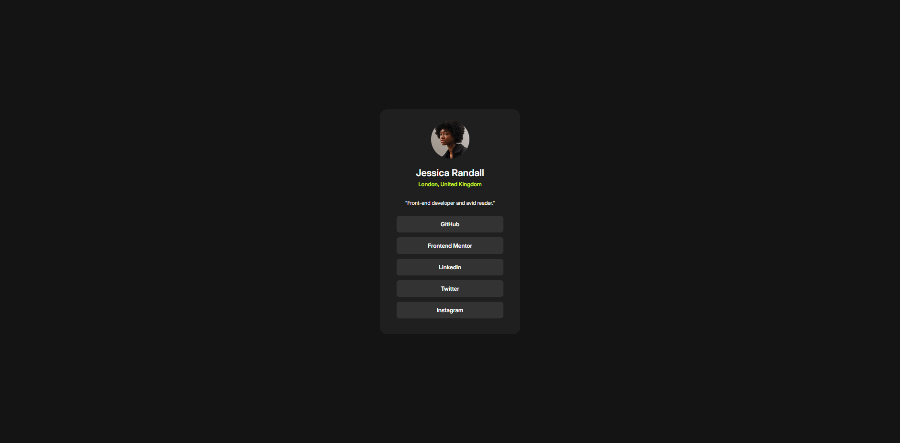

# Frontend Mentor - Social links profile solution

This is a solution to the [Social links profile challenge on Frontend Mentor](https://www.frontendmentor.io/challenges/social-links-profile-UG32l9m6dQ). Frontend Mentor challenges help you improve your coding skills by building realistic projects.

## Table of contents

- [Overview](#overview)
  - [The challenge](#the-challenge)
  - [Screenshot](#screenshot)
  - [Links](#links)
- [My process](#my-process)
  - [Built with](#built-with)
  - [What I learned](#what-i-learned)
  - [Continued development](#continued-development)
- [Author](#author)

## Overview

### The challenge

Users should be able to:

- See hover and focus states for all interactive elements on the page

### Screenshot



### Links

- Solution URL: [Solution URL here](https://github.com/TrEv0rRrRr/Social-links-profile)
- Live Site URL: [Live site URL here](https://trev0rrrrr.github.io/Social-links-profile/)

## My process

### Built with

- Semantic HTML5 markup
- CSS custom properties
- Flexbox

### What I learned

```html
<main>
  <nav>
    <ul>
      <li><a href="http://github.com">GitHub</a></li>
      <li><a href="http://frontendmentor.io">Frontend Mentor</a></li>
      <li><a href="http://linkedin.com">LinkedIn</a></li>
      <li><a href="http://twitter.com">Twitter</a></li>
      <li><a href="http://instagram.com">Instagram</a></li>
    </ul>
  </nav>
</main>
```

```css
li {
  list-style: none;
  background-color: var(--grey-700);
  margin-bottom: 10px;
  padding: 10px;
  text-align: center;
  width: 100%;
  box-sizing: border-box;
  border-radius: 6px;
  cursor: pointer;
  font-size: 12px;
}
```

### Continued development

I thought that I'd use grid for the modeling, but I didn't see it necessary. So I used flex instead.

## Author

- Frontend Mentor - [@TrEv0rRrRr](https://www.frontendmentor.io/profile/TrEv0rRrRr)
